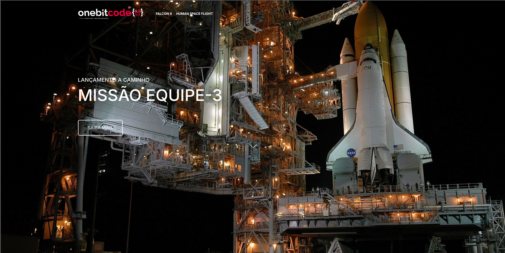

  

 

## Sobre o Projeto

Esta é uma landing page temática da SpaceX construída para consolidar técnicas modernas de front-end. O projeto foi desenvolvido como parte da trilha de Desenvolvedor Full Stack JavaScript da **OneBitCode**.

O principal objetivo foi aplicar conceitos práticos de **UI/UX** e criar uma interface altamente responsiva e fiel ao design original. Para garantir um código limpo e de fácil manutenção, toda a estilização foi construída utilizando o pré-processador **SCSS**, permitindo uma arquitetura de estilos escalável com variáveis, mixins e aninhamento.

## Tecnologias e Conceitos Aplicados

* **HTML5:** Estruturação semântica e acessibilidade.
* **SCSS / SASS:** Modularização de estilos, reaproveitamento de código e variáveis de tema.
* **Flexbox & CSS Grid:** Construção de layouts complexos e alinhamentos precisos.
* **Design Responsivo:** Adaptação fluida para dispositivos móveis, tablets e desktops (Mobile First).

## Como visualizar

Você pode acessar a versão online do projeto aqui: **https://guimarcos.github.io/SpaceX-Page/**

Localmente pode clonar o repositório e usar a extensão Live Server do VSCode.
